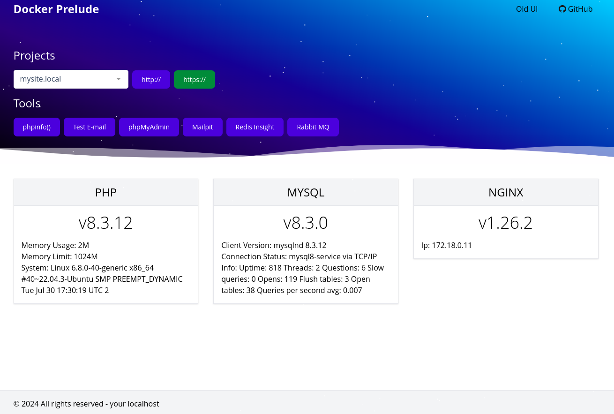

Docker development environment (PHP, MySQL, NGINX)
==================================================

#### Installation process

```bash
# 1. Build all docker services
./build.sh --all 

# 2. Check the status
./build.sh --status

# 3. Install new project
./build.sh -s mysite.local -h

# See more details about build script
./build.sh --help
```
As alternative, it is still possible to use `docker-compose up -d` command.

After than visit Admin Panel http://localhost/ to see new projects available.



Project structure
----------------
```
apps/
--/default <-- admin panal dir
--/mysite.local <-- custom site dir

nginx/
--/conf.d <-- stores generated nginx .conf files
```

phpMyAdmin
----------
PhpMyAdmin panel has link -> http://localhost:8081/
```
Login: root
Password: secret
```

Redis GUI
----------
Redis database user interface available at -> http://localhost:5540/
Based on Redis Insight image.
```
# use Redis host:port
redis-service:6379
```


MailHog
----------
MailHog UI link -> http://localhost:8025/

> See `sendmail_path` configuration in `./php/configs/php-latest.ini` file  
> `sendmail_path = "/usr/local/bin/mhsendmail --smtp-addr=mailhog:1025"`

It is possible to send test e-mail message by http://localhost/sendmail.php script. 

nginx
-----
```bash
# nginx container SSH
docker exec -it devenv-nginx-container /bin/sh
# restart nginx service 
docker-compose restart nginx-service
# rebuild nginx service to update SSL keys
docker-compose build --no-cache nginx-service
```
> :warning: Please take care about nginx host **.conf** files as usually they contain errors and service just can't start

php
---
```bash
# php container SSH
docker exec -it devenv-phplatest-container bash
```

mysql
-----
```bash
# MySQL access from host machine
mysql -h127.0.0.1 -uroot -p [secret]
```

PHP multiversion control
------------------------
By default Admin Panel application use PHP latest version see `./nginx/conf.d/localhost.conf`:
```
    location ~ \.php$ {
        # when using PHP-FPM as a unix socket
        fastcgi_pass phplatest-service:9000;
        ....
    }
```
Where `phplatest-service` is Docker service name see `./docker-compose.yml`.
Take it as example to add new PHP services for each version and don't forget to update appropriate nginx config for your
site `./nginx/conf.d/*`.

Xdebug & PhpStorm
-----------------
1. Firstly please install [Xdebug helper](https://chromewebstore.google.com/detail/xdebug-helper/eadndfjplgieldjbigjakmdgkmoaaaoc)
browser extension.
   - Set IDE key to PHPSTORM
   - Enable debugging
2. Install PhpStorm
   - Check `Settings > PHP > Debug > Debug port` should have `9003`
   - Add server with site host configuration to `Settings > PHP > Servers`
     - additionally add mapping to Server path `/var/www/apps/<mysite.local>`
   - Add [PHP Remote Debug](https://www.jetbrains.com/help/phpstorm/2023.3/run-debug-configuration-php-remote-debug.html) configuration with proper `IDE key` and `Server` selected
   - Set **Run | Break at first line in PHP scripts** to stop on connection established
   - Toggle the **Start Listen PHP Debug Connections** button
   - Refresh browser tab (F5)
   - Also check docs:
     - [Configure Xdebug](https://www.jetbrains.com/help/phpstorm/configuring-xdebug.html)
     - [Zero-configuration debugging](https://www.jetbrains.com/help/phpstorm/2023.3/zero-configuration-debugging.html?php.debugging.zero_configuration)
     - [Profiling with Xdebug](https://www.jetbrains.com/help/phpstorm/2023.3/profiling-with-xdebug.html)

Well done.

License
-------

This software is published under the [MIT License](LICENSE.md)

Thx to Internet community :clap: 

